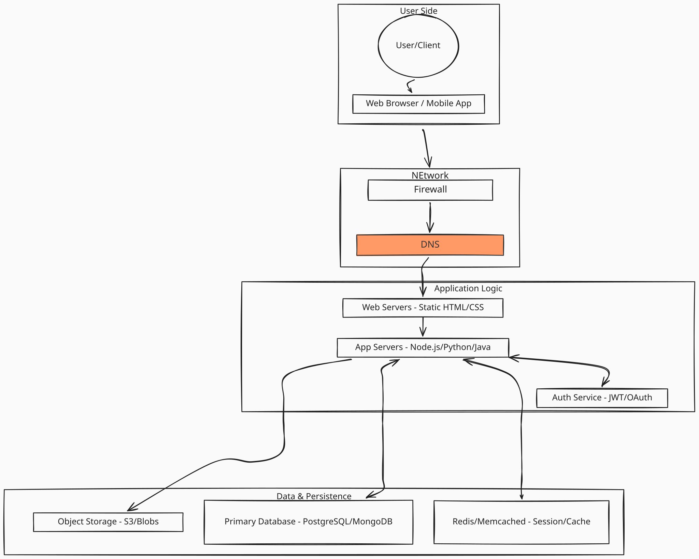

# LU01 HTML Basics

Today we cover basic tags, comments, body vs. header, and titles.
We also cover what needs to be done for unit 1.

- Lab
- Quiz

## WWW History

- [A little History of the WWW](https://www.w3.org/History.html)
- [The first website ever](http://info.cern.ch/hypertext/WWW/TheProject.html)
- [IHCC website 2005](https://web.archive.org/web/20050320171604/https://www.indianhills.edu/)
- What is a server vs a client?

## Look at docs

Again take a look at W3C Docs about HTML.

- [W3C HTML Documentation](https://www.w3schools.com/html/default.asp)
- [Mozilla HTML Documentation](https://developer.mozilla.org/en-US/docs/Web/HTML)

All HTML tags. https://www.w3schools.com/tags/

## Example

Build [`index.html`](./index.html).
While building the example, we will use `
` and `<article>` tags.
These tags are used to group content together. `
` is a generic container, while `<article>` is used for self-contained content that could be distributed independently.

## HTML Validator

Run today's in class example through the HTML validator.

https://validator.w3.org/
