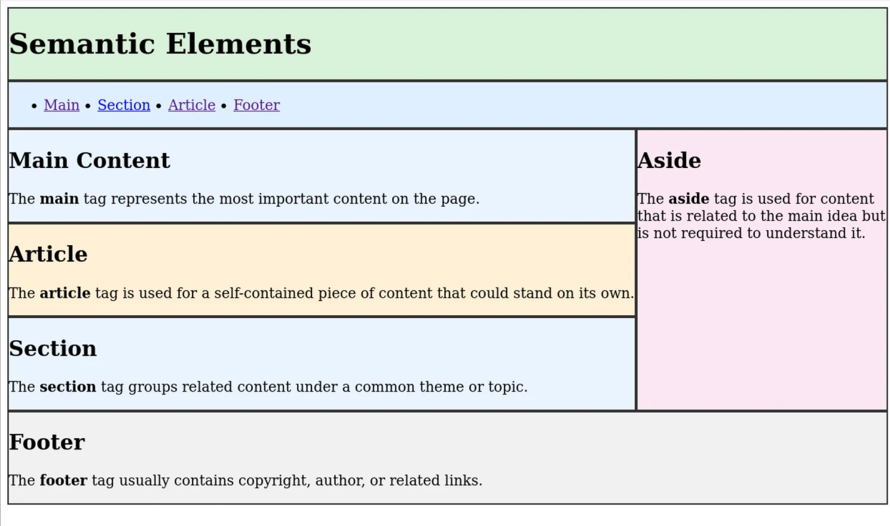

# Semantic Elements

In fall term this week usually lands on labor day meaning we only have 3 days of class.
In this case combine L3 and L4 into one lecture just remove some class time for Site Map.

## What are semantic elements?

[Semantic elements](https://developer.mozilla.org/en-US/docs/Glossary/Semantics) are HTML elements that have a meaning or purpose. They describe the role of the content they contain, making it easier for browsers, search engines, and developers to understand the structure and content of a webpage.

They are `
`s with meaning.

## Diagram

## Example

Go build [Semantic Elements Example](.index.html).
Skip the CSS.
