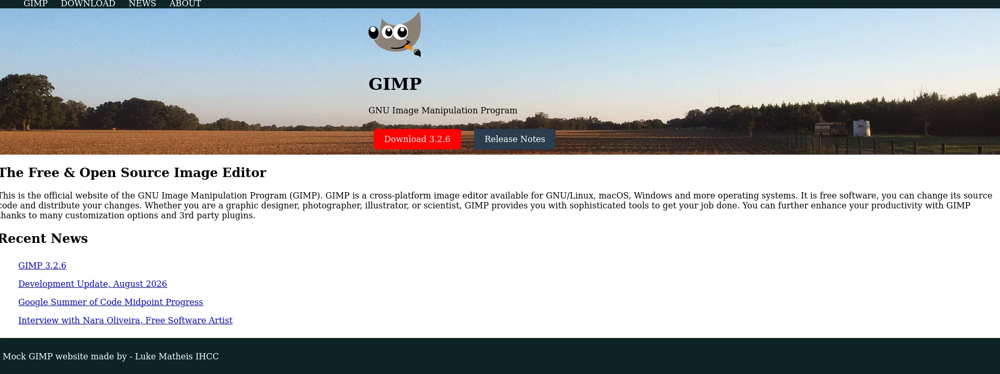

# LU03 Mocking a Full Website

For today's lecture we will be building a full website example with as much polish as we can

## Build Web site content

- Build Mock up of Gimp HomePage
    - [The Page we are trying to Build](https://www.gimp.org/)
- Build the basic structure up to the fold
    - We won't get it perfect since we don't know ALL of CSS yet.
- Right click the images to get a copy.
    - Save Image As...

## Style the page

- Make the CSS external
- Remind the difference between id and cLasses in css.
    - Show nesting targets in CSS.
        - #id space tag name
        - `#hero img`
- Show stealing color codes from website using Dev menu.

Finished [Example](./GimpExample.html)

