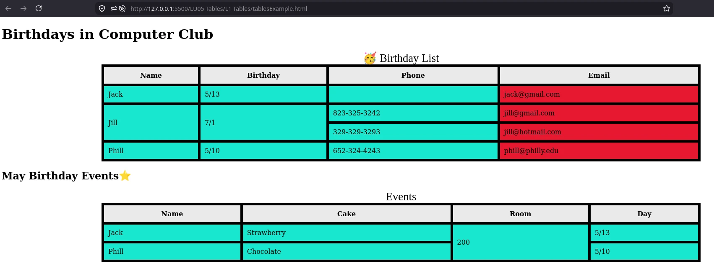

# LU05 Into To Tables

We can organize data into rows and columns using HTML tables.
They work like a spreadsheet.
Tables are useful for displaying data, but they are not recommended for page layout.

## HTML Tables

[W3Schools HTML Tables](https://www.w3schools.com/html/html_tables.asp)

## Example

[`tablesExample.html`](tablesExample.html)

