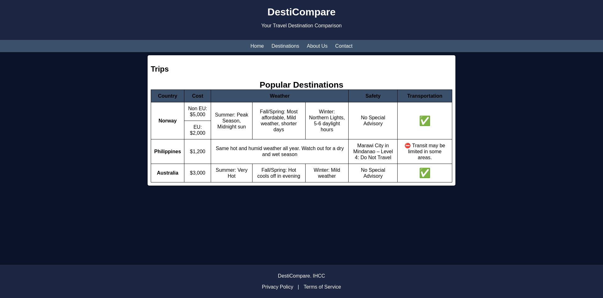

# LU05 Advanced Tables

We will build more complex tables.
We will learn how to use the `colspan` and `rowspan` attributes to create tables that span multiple columns or rows.
We will also learn how to use the `thead`, `tbody`, and `tfoot` elements to create tables with headers, body, and footers.

## Example

Use the `.zip` file from Blackboard to get started.
Finish the pages on the [`destinations.hml`](./Advnaced%20Table/html/destinations.html) page

