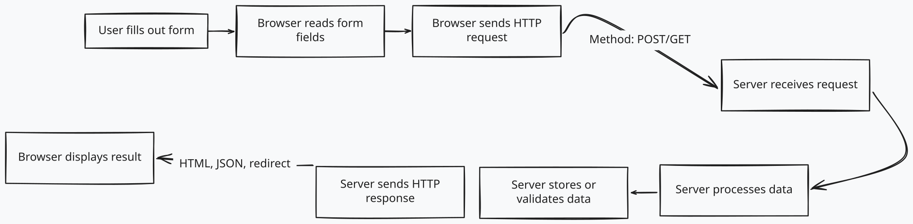

# LU06 Form Fields

- [w3](https://www.w3schools.com/html/html_forms.asp)
- [Mozilla](https://developer.mozilla.org/en-US/docs/Web/HTML/Element/form)

We are not covering the `action` attribute in this lecture or Labels yet.

## What Can Forms Be Used For?

Forms are not just used filling our long forms. They are used anytime you want to collect information from a user. This could be for:

- A button like a "like" button on a social media post
- A search bar on a website
- A login form for a website

## Where does form Data go?

Below is a diagram showing how form data is sent to a server and how the server responds.

## Building a Form

Build [This Form](./index.html).

EOD
