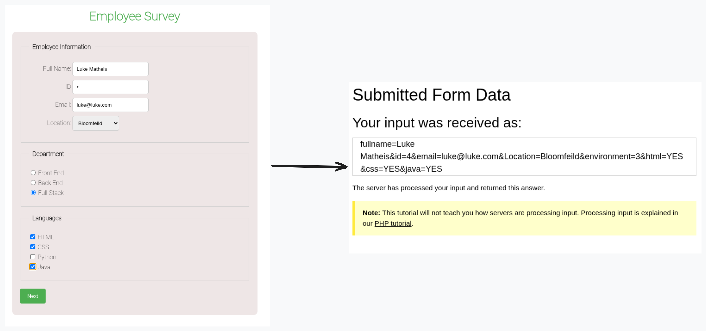

# LU06 Forms

Today we will add labels to form elements and learn about the `action` attribute.

## `action` Attribute

Why are we sending form data to W3Schools? Because we don't have a server to send the data to.
They have a generic server that will accept form data and send a response back to us.
The response is the HTML page with our data

```html
<form action="https://www.w3schools.com/action_page.php" method="post">
    <!-- Form fields will go here -->
</form>
```



## Fonts

Make sure to include in the header and in CSS style
[Link to Font](https://fonts.google.com/specimen/Roboto)
Make sure you click the "Add" button

```html
<link rel="preconnect" href="https://fonts.googleapis.com" />
<link rel="preconnect" href="https://fonts.gstatic.com" crossorigin />
<link
    href="https://fonts.googleapis.com/css2?family=Roboto:wght@100&display=swap"
    rel="stylesheet"
/>
```

[W3 Link Example](https://www.w3schools.com/css/css_font_google.asp)
