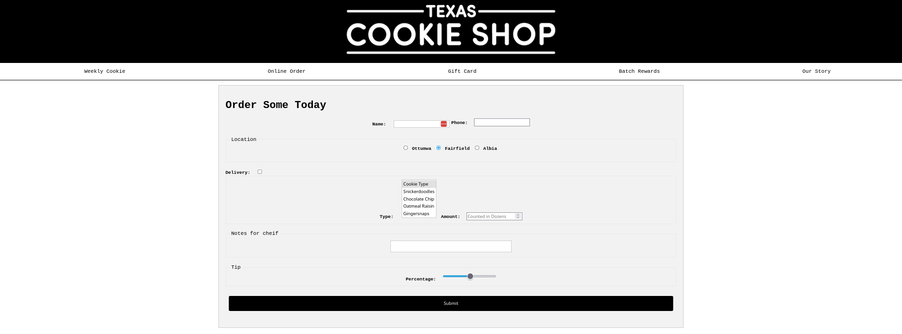

# LU06 Forms

This is a longer example.

## File Structure

Review what the file structure looks like for this example.
Remind students their final project will have a similar file structure.
Notice the home page `index.html` is in the root folder and the second page `order.html` is in a subfolder called `html`.
It is important the home page is always in the root.

```
Cookie Example/
├─ css/
│  ├─ order.css
│  ├─ styles.css
├─ html/
│  ├─ orders.html
├─ images/
|   ├─ Logo White.png
|   ├─ icon.png
├─ favicon.ico
├─ index.html
```

Used [ascii-tree-generator](https://ascii-tree-generator.com/) to generate the above tree.

## Cookie Example

- Download the images zip from blackboard.
- build [index.html](./index.html)
- build [style.css](./css/styles.css)
- Copy `index.html` to a subfolder called `html` and build [order.html](./html/order.html)
- Add a second CSS file called `order.css` to the `css` folder and build [order.css](./css/order.css)



## Field Validation

- [w3 Form Validation](https://www.w3schools.com/htmlcss/htmlcss_forms_validation.asp)

We can add simple front-end validation to our form fields.
This is not for security but to help the user fill out the form correctly.
Font-end validation can be bypassed by a user, so it just for UX.

## Personal Project: Content

The above example might take two full days but if not.
Use reminding time (full L4 time if needed) to work on your personal project.
