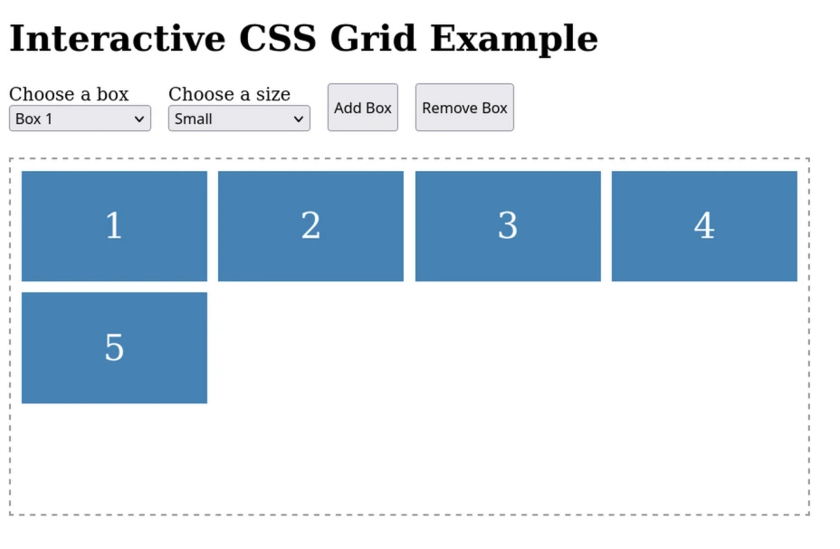
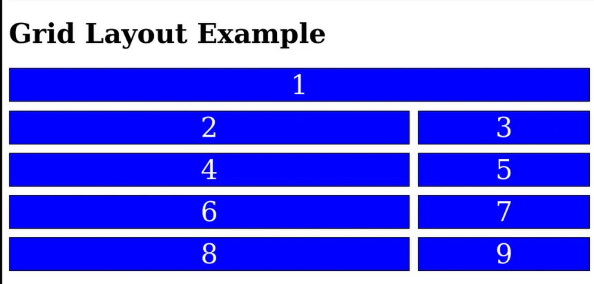

# Grid Layout

Grid layout is another display property that allows you to create a grid of rows and columns.
This is a **newer** layout method that doesn't replace flexbox, but can be used in conjunction with it.

- [MDN Grid Layout](https://developer.mozilla.org/en-US/docs/Web/CSS/CSS_Grid_Layout)
- [W3Schools Grid Layout](https://www.w3schools.com/css/css_grid.asp)
- [Flagship Grid Layout in 100s](https://www.youtube.com/watch?v=uuOXPWCh-6o)

## Grid Layout Interactive Example

Allow students download and play with [this interactive example](./InteractiveGridExample/index.html).

## Grid Layout Example

Together lets build a simple grid layout example.
We wil build some "blocks" `div` elements with a background color and move them around.

- [Grid Layout Example](./GridLayoutExample/index.html)

