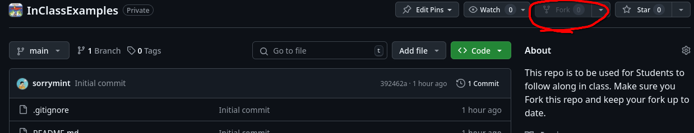
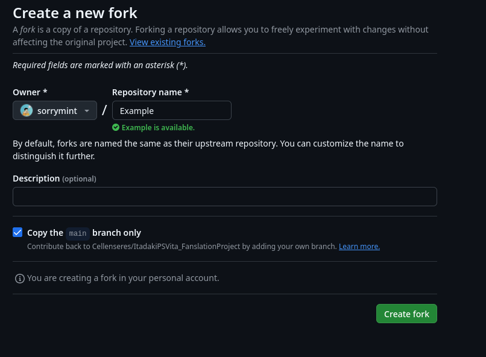
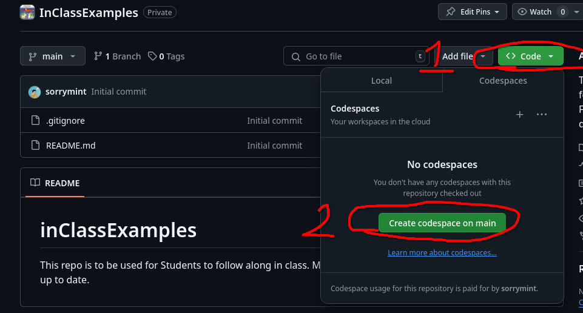
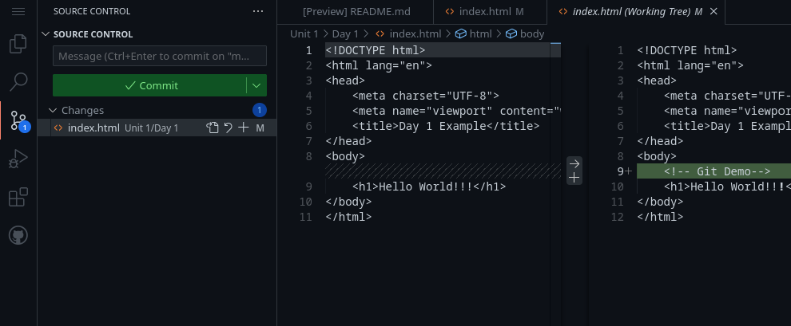

# BCA 185 Lecture Notes

If you do not have a Windows, MacOS, or Linux system then you can use GitHub's [Codespaces](https://github.com/features/codespaces) feature using this repo.
Each day in class just make another Folder for each Unit/Day. Make sure to **keep your fork up to date**.

> ⚠️ This repo is in active development and may change at any time. Please check back often for updates.

## Codespaces

Fork this repo with the button in the top right corner.

You can rename your fork if you like.

Now in your fork code page. Click the "</>Code" button and navigate to the "CodeSpaces" tab. Click the "Create codespace on main" button.

## Updating your Repo

While your codespaces do auto save they auto delete after a few days without use.
To make sure you don't loss any progress you will need to use Git.
Keep in mind Git is a CLI program for version control.
GitHub is just a website to host our Git repos.
We will want to use Git to keep our progress.

### Make a change

Make a change any change to your website. For example I just added a commit to my Unit 1/Day 1 example.

After you make your change you should see it in the "Source Contorl" panel in VSCode.

### Commit and Push

Click the "+" next to the files you want to change (stage them). Write a message. Then click the commit button. Then finally click the "Sync Changes" button. Now your changes are saved on GitHub.

Repeat the "Make a change" and "Commit and Push" each time you want to save a change.

In this repository, you will find lecture notes for the BCA 185 course.
Each Learning Unit (LU) contains folders with Lecture Notes (L#).
Each day has all main topics covered in the lecture, links to reference materials, and Coding Example files.

## Learning Unit Outlines

| LU # | Name                        | Description                                                                                                                 |
| ---- | --------------------------- | --------------------------------------------------------------------------------------------------------------------------- |
| 01   | Setup and First HTML        | Set up your development environment and build your first web page using core HTML structure.                                |
| 02   | Lists and Links             | Organize content with ordered, unordered, and description lists. Navigate to different HTML pages using `<a>` links.        |
| 03   | Style                       | Make your web pages visually appealing using CSS. Change colors, fonts, and spacing.                                        |
| 04   | Layout & Images             | Arrange content on your web pages using Flex Box. Use the `` tag to add images.                                        |
| 05   | Tables                      | Build HTML `<tables>` with proper headers, captions, and accessible structure for data display.                             |
| 06   | Forms                       | Create user-friendly `<form>`s with labels, input types, grouping, and validation-focused design.                           |
| 07   | Grid Layout & Media Queries | Build responsive page layouts with CSS Grid and media queries for desktop and mobile screens.                               |
| 08   | Accessibility               | Improve usability by applying accessibility principles including semantic markup, alt text, and readable structure.         |
| 09   | Multimedia & JS             | Add multimedia (images, videos, audio) and introductory JavaScript to create more interactive and engaging web experiences. |
| 10   | Web Publishing              | Prepare, publish, and maintain a website using GitHub. Turn in your final Personal Project.                                 |

## Learning Resources

## Contributing

If you see a problem with a lecture or have suggestions for improvement, please feel free to open an issue or submit a pull request.

LU01 Planning Worksheet

LU02 Site Map

LU03 Research paper

LU04 Wireframe

<!-- LU05 -->

<!-- ## Personal Project Part 1: File Structure -->

<!-- LU06 -->

<!-- ## Personal Project Part 2: Raw Content -->

<!-- LU07 -->

<!-- ## Personal Project Part 3: Media -->

<!-- LU08 -->

<!-- ## Personal Project Part 4: Layout -->

<!-- LU09 -->

<!-- ## Personal Project Part 5: Design -->

<!-- LU10 -->

<!-- ## Personal Project Part 6: Web Publishing -->
